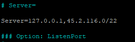

# OPA SUITE + MONGODB + PYTHON


## ZABBIX-AGENT

> no servidor Opa Suite...

```sh
apt update
apt install zabbix-agent -y
```

```sh
service zabbix-agent status
```


> Edite o arquivo '/etc/zabbix/zabbix_agentd.conf'

```sh
nano /etc/zabbix/zabbix_agentd.conf
```

> Altere a linha "# EnableRemoteCommands=0" para "EnableRemoteCommands=1"


> Libere o IP ou rede do seu Zabbix server



> Reinicie o serviço do zabbix-agent no Opa Suite

```sh
service zabbix-agent restart
```

> No Zabbix Server faça o teste de comunicação com o Zabbix Agent instalado no servidor Opa Suite

```sh
zabbix_get -s ip_do_opa_suite -k "system.run[echo Funcionando...]"
```


## PYTHON

```sh
mkdir /home/scripts
nano /home/scripts/opaSuite.py
```

> Copie o código em python e cole no servidor

- [Script em Python](./recursos/python/opaSuite.py)


## ZABBIX

> Contador de usuarios ativos

```js
$[?(@.status == "A")].length()
```

> Contador de usuarios online

```js
$[?(@.online == "on")].length()
```

> Contador de Atendimento por Usuários

```js
// macros
{#NOME} -> $.nome
{#ID_ATENDENTE} -> $._id.oid

//pre processsamento do prototipo de item
$[?(@.id_atendente.oid == "{#ID_ATENDENTE}")].length()
```

> Contador de atendimentos por canal

```js
$[?(@.canal == "whatsapp")].length()
$[?(@.canal == "messenger")].length()
$[?(@.canal == "pabx")].length()
```

> Contador de atendimentos por Setor/Departamento

```js
{#DEPARTAMENTO} -> $.nome
{#ID_DEPARTAMENTO} -> $._id.oid

//pre processsamento do prototipo de item
$[?(@.setor.oid == "{#ID_DEPARTAMENTO}")].length()
```

## GRAFANA

- Contador de usuários
  - Total ativo
  - Total online

- Contador de atendimentos
  - Aguardando atendimentos
    - Por setor/departamento
    - Por canal
  
  - Em atendimento
    - Por setor/departamento
    - Por canal

- Contador de atendimentos para cada usuário


- [Script em Python](./recursos/python/opaSuite.py)

- [Dashboard do Grafana](./recursos/grafana/dashboard_opa_suite.json)

- [Template do Zabbix](./recursos/zabbix/OpaSuiteTemplate.xml)
