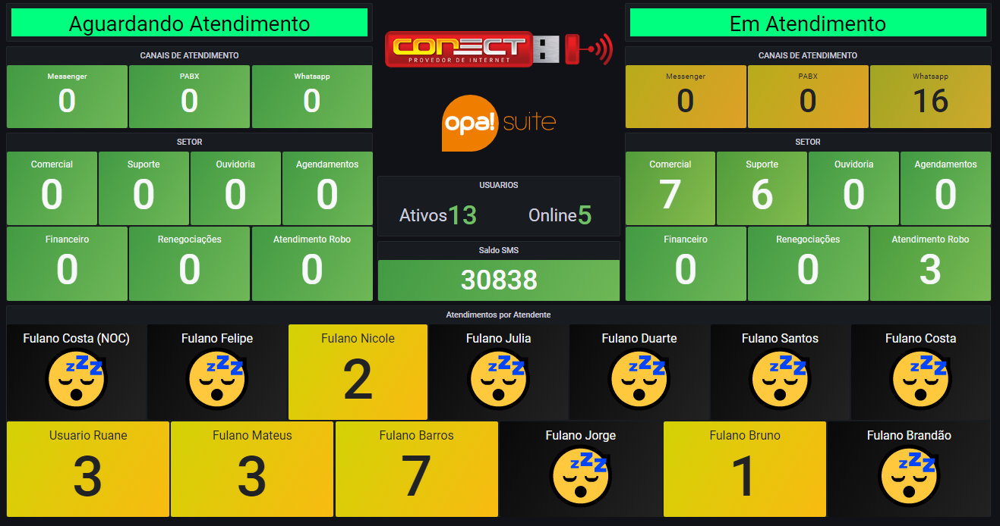

# OPA SUITE + MONGODB + PYTHON

- Contador de usuários
  - Total ativo
  - Total online

- Contador de atendimentos
  - Aguardando atendimentos
    - Por setor/departamento
    - Por canal
  
  - Em atendimento
    - Por setor/departamento
    - Por canal

- Contador de atendemento para cada Usuário



## Usuarios

> Contador de usuarios ativos

```js
$[?(@.status == "A")].length()
```

> Contador de usuarios online

```js
$[?(@.online == "on")].length()
```

> Contador de Atendimento por Usuários

```js
// macros
{#NOME} -> $.nome
{#ID_ATENDENTE} -> $._id.oid

//pre processsamento do prototipo de item
$[?(@.id_atendente.oid == "{#ID_ATENDENTE}")].length()
```

> Contador de atendimentos por canal

```js
$[?(@.canal == "whatsapp")].length()
$[?(@.canal == "messenger")].length()
$[?(@.canal == "pabx")].length()
```

> Contador de atendimentos por Setor/Departamento

```js
{#DEPARTAMENTO} -> $.nome
{#ID_DEPARTAMENTO} -> $._id.oid

//pre processsamento do prototipo de item
$[?(@.setor.oid == "{#ID_DEPARTAMENTO}")].length()
```
